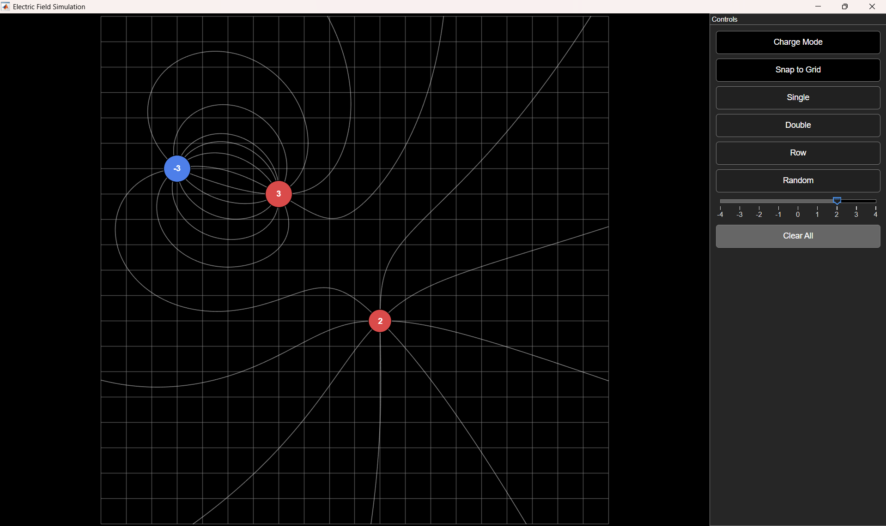
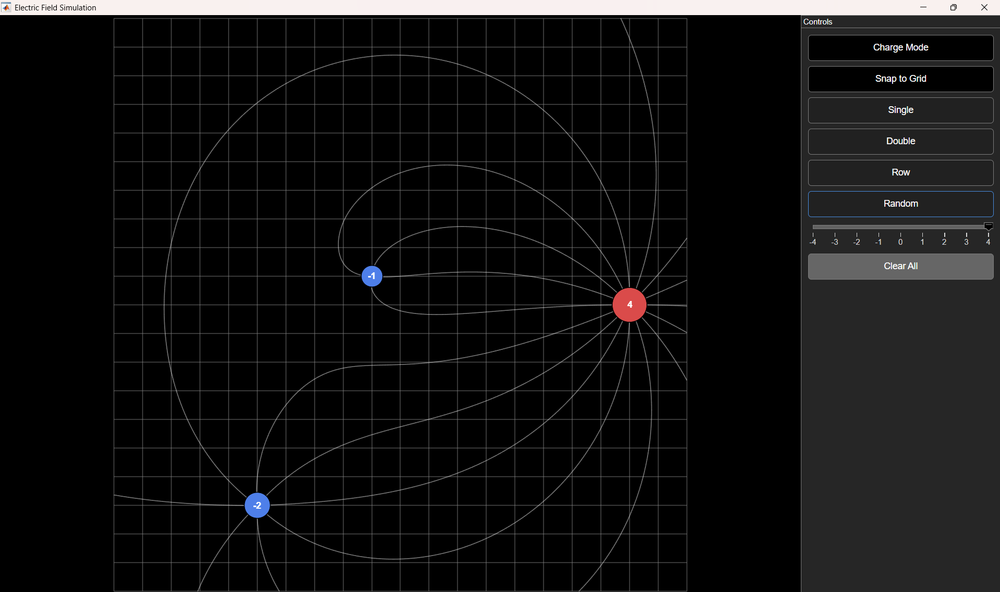

# electric-field-sim

An interactive electrostatics visualizer built in MATLAB. Place positive and negative point charges on a canvas and watch field lines trace in real time as you add, move, and adjust them. 

## Controls

| Control | Effect |
|---|---|
| Click empty canvas | Place a new charge at that location (strength 0 until set) |
| Click existing charge | Select it, so the slider reflects/edits its strength |
| Drag a charge | Reposition it; field lines retrace live |
| Strength slider | Set the strength of the currently selected charge (-4 to +4) |
| Charge Mode toggle | Enable/disable placing new charges on click |
| Snap to Grid toggle | Snap placed/dragged charges to the grid |
| Clear All | Remove every charge from the canvas |
| Single / Dipole / Row / Random | Load a preset configuration |

## Requirements

- MATLAB 
- Image Processing Toolbox
